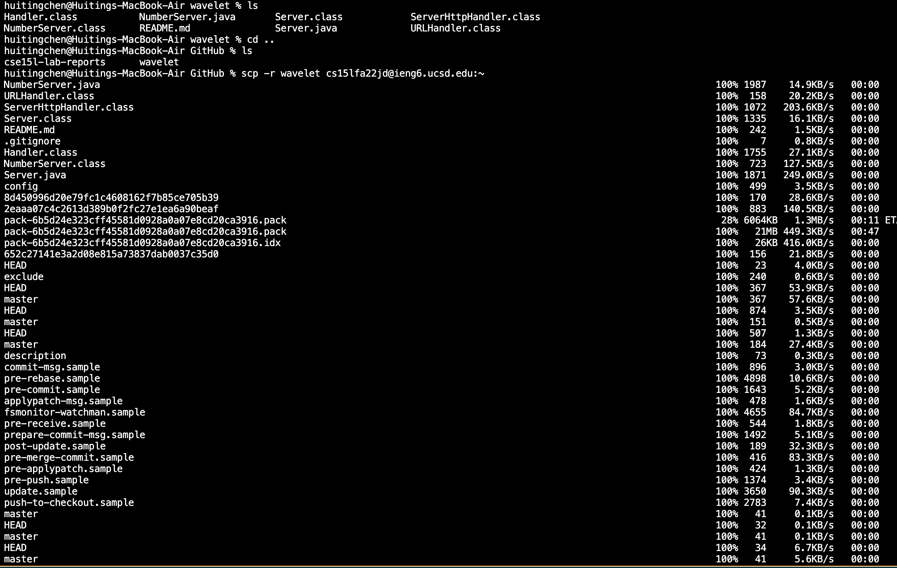

**The URL Handler Interface** \
handleRequest takes url as an argument and will return a String. The method initializes the num to 0. If the path of the url is “/”, then num doesn’t change and returns “Number:” num. Else, if the path of the url is “/increment”, then the 1 is added to the num and returns “Number incremented!”. Else, if the path of the url is neither “/” nor “/contain”, then print out “Path:” followed by the path of the url. If “/add” is contained in the path, the query of the url is broken into a list by “=” in it. If the list has “count” in the index zero (the query of the url starts with “count”), the number in the  index 1 (the number after “count=”) is added to num and “Number increased by” the number in the index 1 “! It’s now” num. Else, if the path is not “/” or “/increment” and doesn’t contain “/add” and its query starts with “count”, it will return “404 not found”. The main method checks if the argument is empty. If it is, then it will return “Missing port number! Try any number between 1024 to 49151”. If the argument is not empty, then get the first input and turn it into the integer and store it as a variable port. Then call the method Server.start with the argument port and a new constructed Handler.
***
**Building and Running the Server**

***
**Run the Server on a Remote Computer**

Maybe can create simple search engine which show things based on the path and query of url inputed.
***
**Make the Simplest "Searching Engine"**\
[Searching Engine](SearchEngine.java)
